# AI-Powered Disaster Resource Locator

**A production-ready, full-stack disaster management system that leverages AI to automatically triage emergency reports and allocate critical resources.** 
This system is designed for emergency response teams to quickly filter through the noise of citizen reports during a crisis, prioritizing the most severe incidents using Google Gemini AI, and connecting them to available nearby resources (hospitals, shelters, blood banks, etc.).

---

## 🚀 Live Demo

- **Production URL:** [https://disaster-resource-locator-5vne.onrender.com](https://disaster-resource-locator-5vne.onrender.com) *(May take 30-50s to spin up on initial load due to Render free tier)*
- **Admin Credentials:** `admin@disaster.dev` / `admin1234`
- **Citizen Credentials:** `citizen@disaster.dev` / `citizen1234`

---

## 🏗️ Architecture

```mermaid
graph TD
    Client[Browser / Mobile] -->|HTTP GET / POST| Render[Render Single Web Service]
    
    subgraph Render Hosting
        Render -->|Route: /api/v1/*| FastAPI[FastAPI Backend]
        Render -->|Route: /*| React[React SPA / Static Assets]
    end

    FastAPI -->|Async SQLAlchemy| DB[(Neon Serverless Postgres)]
    FastAPI -->|REST API| Gemini[Google Gemini AI]
    
    classDef render fill:#4d4d4d,stroke:#fff,stroke-width:2px;
    classDef db fill:#00e599,stroke:#000,stroke-width:2px,color:#000;
    classDef ai fill:#4285F4,stroke:#fff,stroke-width:2px;
    
    class Render render;
    class DB db;
    class Gemini ai;
```



---

## 🛠️ Tech Stack

| Domain | Technologies |
|---|---|
| **Backend** | Python 3.11, FastAPI, SQLAlchemy 2.0 (Async), asyncpg, Alembic, Pydantic |
| **Frontend** | React 18, Vite, Tailwind CSS, React Query (Tanstack), React Router, Leaflet/react-leaflet |
| **AI Integration** | Google GenAI SDK (Gemini 2.5 Flash) |
| **Database** | Neon Serverless PostgreSQL |
| **Deployment** | Docker (Multi-stage build), Render (Single Web Service) |

---

## ✨ Features

- **AI-Powered Incident Triage:** Citizens submit unstructured natural language reports. The system uses Google Gemini to extract structured entities (number of people, hazards, infrastructure damage) and then applies a deterministic rule-based formula to assign a severity score (1-10).
- **Patient Triage (START Protocol):** Built-in logic for the Simple Triage and Rapid Treatment (START) algorithm, categorizing patients into Immediate, Delayed, Minor, or Expectant based on clinical signs.
- **Live Priority Dashboard:** A command-center dashboard featuring a heat map of incidents and a live priority queue sorted automatically by AI-calculated severity.
- **Resource Management:** Real-time tracking of hospitals, shelters, NGOs, and blood banks, including capacity and status, allowing dispatchers to allocate resources efficiently.
- **Role-Based Access Control (RBAC):** Strict JWT-based segregation between `admin` (dispatchers) and `citizen` (reporters).

---

## 🖥️ Local Setup Instructions

You run **two terminals** — backend and frontend separately. The Vite dev server proxies `/api/*` requests to the FastAPI backend.

### 1. Backend Setup

```bash
# Clone the repository
git clone https://github.com/Jainaksh23/Disaster-Resource-Locator.git
cd "Disaster-Resource-Locator/backend"

# Create and activate virtual environment
python -m venv .venv
# Windows: .venv\Scripts\activate
# macOS/Linux: source .venv/bin/activate

# Install dependencies
pip install -r requirements.txt

# Environment variables
cp ../.env.example .env
# Edit .env and set:
# - DATABASE_URL (Neon Postgres connection string)
# - GEMINI_API_KEY (Google AI Studio key)
# - JWT_SECRET (Random 32+ char string)

# Run database migrations
alembic upgrade head

# Start backend server
uvicorn main:app --reload --port 8000
```

### 2. Frontend Setup

```bash
cd frontend

# Install dependencies
npm install

# Start Vite dev server (proxies /api/* to localhost:8000)
npm run dev
```
Access the local app at `http://localhost:5173`.

### 3. Production Build (Local Testing)
To test the single-service architecture locally:
```bash
cd frontend
npm run build
cd ../backend
uvicorn main:app --host 0.0.0.0 --port 8000
```
Access the fully integrated app at `http://localhost:8000`.

---

## 📖 API Documentation

Once the backend is running, fully interactive Swagger UI documentation is automatically generated and available at:
👉 **[http://localhost:8000/api/docs](http://localhost:8000/api/docs)**

### Key Endpoints
- `POST /api/v1/reports/`: Create an incident report (triggers AI triage).
- `GET /api/v1/dashboard/stats`: Aggregated metrics for the Ops Center.
- `GET /api/v1/dashboard/map-pins`: GeoJSON/lat-lng points for the heat map.

---

## 📂 Project Structure

```text
.
├── backend/                 # FastAPI service
│   ├── core/                # JWT Auth, database setup, environment config
│   ├── models/              # SQLAlchemy ORM definitions
│   ├── routers/             # API route handlers
│   ├── schemas/             # Pydantic request/response validation
│   ├── services/            # Business logic (gemini_service.py)
│   ├── migrations/          # Alembic tracking
│   ├── main.py              # FastAPI app — routes + SPA serving
│   └── requirements.txt     
├── frontend/                # React (Vite) SPA
│   ├── src/
│   │   ├── api/             # Relative-path API client
│   │   ├── components/      # Reusable Tailwind UI components
│   │   ├── pages/           # Route views (Dashboard, Reports, Map, etc.)
│   │   └── App.jsx          # React Router setup
│   └── vite.config.js       # Proxy config
├── Dockerfile               # Multi-stage (Node build → Python runtime)
├── render.yaml              # Render deployment configuration
└── .env.example             
```

---

## 🧠 Key Design Decisions

### 1. Single-Service Deployment Architecture
**Decision:** Serve both the React frontend and FastAPI backend from a single Docker container/Render service.
**Why:** Disaster management tools need absolute reliability and ease of deployment. By having FastAPI mount the static React build (`/assets/*`) and act as a catch-all for SPA routing, we completely eliminate CORS configuration issues, remove the need to manage `VITE_API_URL` environments, and cut hosting costs in half. 

### 2. Hybrid Triage: AI + Deterministic Rules
**Decision:** Use LLMs for entity extraction, but use hardcoded math for the final severity score.
**Why:** Pure LLM scoring is non-deterministic and can hallucinate severity based on phrasing. By asking Gemini to only output JSON data (e.g., `"injured_count": 5, "infrastructure_damage": true`), the backend parses this and applies a deterministic formula (`severity = injured_count * 2 + damage_modifier...`). This guarantees consistent, mathematically verifiable triage while still benefiting from NLP.

### 3. Serverless Postgres (Neon) vs Built-in DBs
**Decision:** Use Neon PostgreSQL instead of Render's built-in DB or SQLite.
**Why:** Neon offers true serverless scaling. In a disaster scenario, traffic spikes unpredictably. Neon scales compute to zero when idle (saving costs) and scales up instantly during an event. The `postgresql+asyncpg` driver ensures non-blocking database I/O for high concurrency.

---

## ⚠️ Known Limitations & Future Work

- **RAG / SOP Document Retrieval (Currently Disabled):** The system was initially designed to use FAISS to retrieve Standard Operating Procedures (SOPs) based on the incident report. However, this is temporarily disabled due to compatibility issues between Google's newer `AQ.` format API keys and their embedding models. Once Google resolves this upstream, the FAISS logic in `rag_service.py` will be re-enabled.
- **WebSocket Live Updates:** Currently, the dashboard relies on React Query polling. Future iterations will implement FastAPI WebSockets to push live map updates instantly.
- **Push Notifications:** Dispatching SMS or Push Notifications to NGOs/Resources via Twilio API when high-severity events occur nearby.

---

## 📸 Screenshots

*(Screenshots placeholder - Add application screenshots here)*

---
*Developed for a robust, fast, and scalable response to critical emergencies.*
